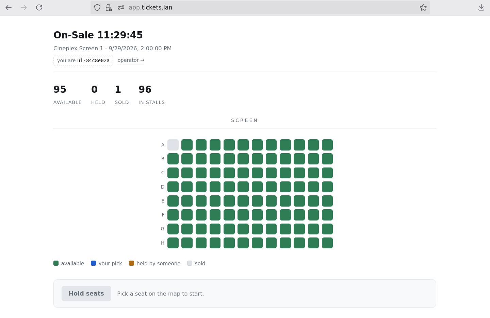
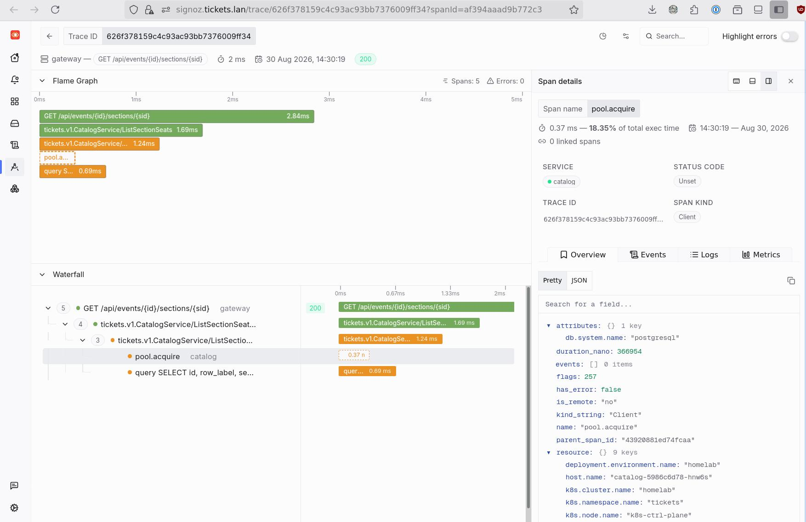
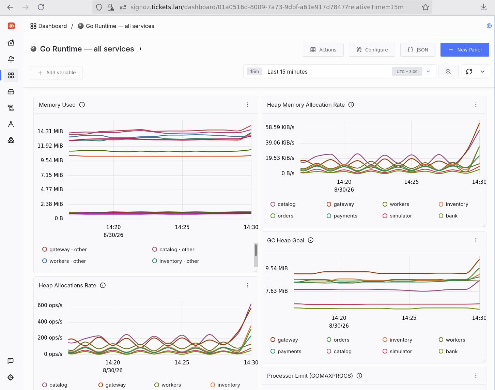
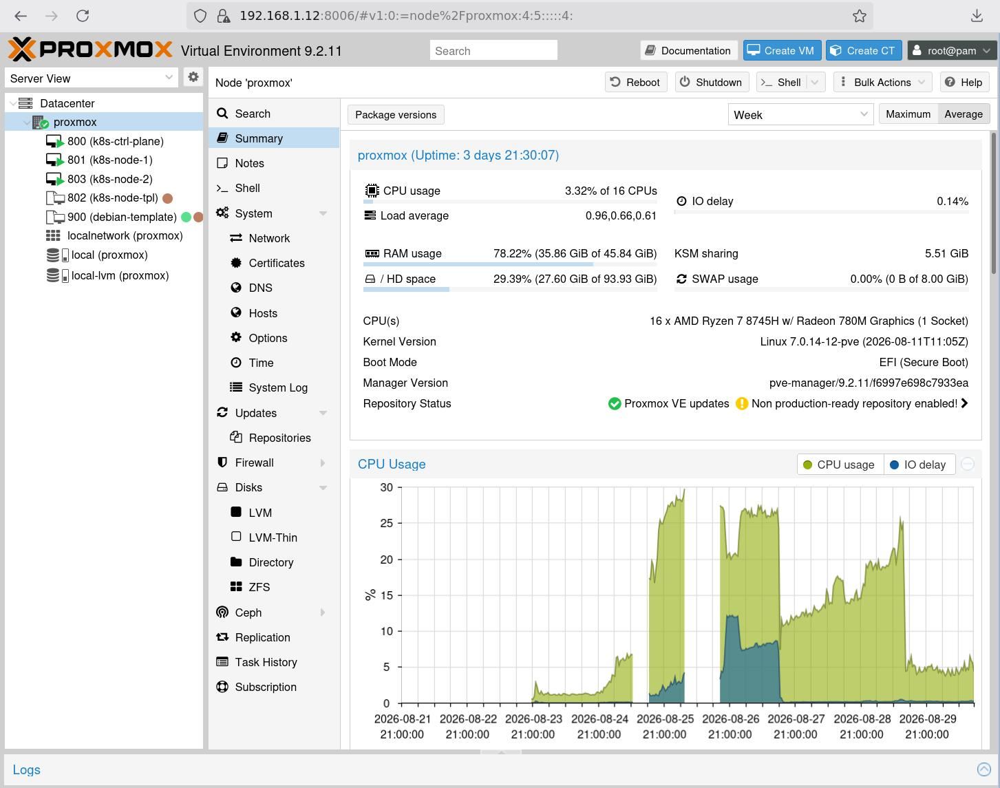

# tickets

A ticket-selling system — assigned seating, real contention — built to be **operated for
real** on a homelab Kubernetes cluster. The product is fake; the operations are not. A
simulated population of buyers keeps it under continuous load on actual hardware, so that
distributed-systems failures happen to me rather than get read about.

The one hard problem, which everything else is scaffolding around:

> N buyers, M seats, N >> M. Never sell the same seat twice. Never lose a seat to a
> checkout that died.

**This is a study project, and it is vibe coded** — written largely by talking to an LLM,
kept honest by running it on real infrastructure under real load. It sells nothing, takes
no money, and nothing in it is meant for production use by anyone else. Read `DESIGN.md`
for the system, `PLAN.md` for the build order, and `infra/CLUSTER.md` for the cluster.

## What it looks like

The seat map. React SPA at `app.tickets.lan`, one section at a time, updated by
server-sent events rather than polling.



One request, end to end, in SigNoz. Browser → gateway → catalog → connection pool →
Postgres, with the query on the bottom row. Every service emits OTel traces, metrics and
logs from the same SDK.



Go runtime metrics for every service on one dashboard — heap, allocation rate, GC goal,
GOMAXPROCS. The climb at the right edge is the simulator ramping up.



## Stack

| Layer | What | Why |
|---|---|---|
| Services | **Go 1.27**, nine binaries | One process per bounded piece of the problem |
| Contracts | **gRPC / protobuf**, generated with **buf** | The `.proto` files are the only definition of what crosses a boundary |
| Truth | **PostgreSQL** (CloudNativePG) | The seat claim is one conditional `UPDATE`; this is where the invariant lives |
| Events | **Kafka** (Strimzi) | Seat state changes published once, instead of every browser polling |
| Cache | **Redis** | Seat-map projection only. Flushing it in production must cost latency and nothing else |
| Web | **React + Vite**, static nginx image | The seat map, and the SSE client |
| Cluster | **kubeadm Kubernetes**, 3 nodes, flannel, local-path | The homelab. See `infra/CLUSTER.md` |
| Metal | **Proxmox VE 9** on one 16-core Ryzen box, 3 KVM guests | The whole cluster is one machine on the LAN |
| Edge | **Envoy Gateway** (Gateway API) + **MetalLB** | `*.tickets.lan`, LAN-only, RFC1918 throughout |
| Delivery | **Argo CD**, app-of-apps from this repo | Monorepo → image → cluster, no hand-applied YAML |
| Observability | **OpenTelemetry** → **SigNoz** | Traces, metrics and logs; plus pprof and PGO builds |

## The components

Nine Go binaries under `services/` (each is a binary iff it has a `cmd/`), plus the web
SPA. Longer version in `services/README.md`.

- **gateway** — the public API, the only thing a browser talks to. Owns no data and holds
  no database credentials at all; it asks catalog what exists, inventory what is
  available, orders to buy. Also serves the SSE seat-map stream.
- **catalog** — what *exists*: venues, sections, seats, events, prices. Read-heavy, almost
  never written, and deliberately forbidden from writing seat status.
- **inventory** — what is *available*. The contended core, and the only writer of seat
  status anywhere — enforced by topology, since nothing else has credentials for the
  schema. Owns holds and their expiry.
- **orders** — the saga. Drives created → awaiting payment → paid → confirmed, writing the
  saga log before each attempt. Recovery is forward, never backward.
- **payments** — whether money moved. The only service that talks to the bank, written
  around the case where the bank takes the money and then says nothing, so `unknown` is a
  first-class state that must not release the seats.
- **workers** — every singleton in one process: hold sweepers, payment reconciler, order
  resumer. Pinned to one replica, `strategy: Recreate`.
- **simulator** — the load. Virtual buyers as state machines, arriving as a Poisson
  process. A client, not a peer: it gets a base URL and nothing else.
- **bank** — a deliberately adversarial fake payment processor. Declines, times out, and
  sometimes charges silently. Idempotency keys make a retried timeout return the original
  charge.
- **seeder** — a CronJob that creates a showing a day, so the system always has something
  real to do.
- **web/** — the React seat map. Not a Go service; its own nginx image.

Shared code lives in `pkg/` (observability, logging, health, Kafka events, Redis cache,
migrations, pprof, test harnesses), generated code in `gen/`, protobufs in `proto/`,
manifests in `deploy/`, cluster notes in `infra/`.

## The metal

There is no cloud here. Everything runs on one physical machine on the LAN — a 16-core
AMD Ryzen 7 8745H with 45 GiB of RAM — running **Proxmox VE 9** as the hypervisor.



Three KVM guests on that one host are the entire Kubernetes cluster:

| VM | Role | vCPU | RAM | Disk |
|---|---|---|---|---|
| `k8s-ctrl-plane` (192.168.1.116) | control plane, single-member etcd | 6 | 12.5G | 40G |
| `k8s-node-1` (192.168.1.88) | worker | 4 | 14.5G | 120G |
| `k8s-node-2` (192.168.1.24) | worker | 4 | 14.5G | 120G |

Debian 13, kubeadm, flannel for the CNI, and `local-path` as the only StorageClass — so
volumes are pinned to the node's own disk, which is why Postgres runs as a single instance
and why replicas here would be availability theatre. Every VM disk lives in one LVM-thin
pool on one physical disk; total allocation is deliberately kept under the pool size,
because a filled over-committed thin pool freezes every guest at once.

The honest consequences of one host: a hypervisor reboot takes the whole cluster down,
etcd has one member and no backup job, and there is no object storage, so Postgres has no
point-in-time recovery. Nothing in this system is allowed to be irreplaceable. Everything
is RFC1918 and reachable only from the LAN — which is what makes this repo safe to keep
public so that Argo CD can clone it without credentials.

## Running it

```sh
make help      # every target
make pg-up     # throwaway Postgres for tests
make test      # go test -race -shuffle=on
make oversell  # MANUAL: 1000 goroutines vs 10 seats — the invariant, under load
```

Deployment is GitOps: push to `main`, CI builds images, Argo CD syncs the cluster from
`deploy/`. Nothing is applied by hand.
